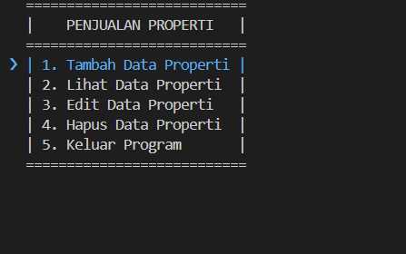

# 👾 Hacks Terminal Python ⬇️

**Repo ini menampilkan berbagai hacks di terminal Python**  

Yang bikin kalian **merasa keren** sambil **seru-seruan aja**   

> **Yakali dilewatin, yekan??** 

> Kalau kalian mau mencari tau lebih banyak, kunjungi website resmi ini: [Pypi](https://pypi.org/)

---

## 🌟 Demo 1: hack_01_arrow_menu.py

<p align="center">
  
</p>

Script pertama ini membuat **arrow key menu interaktif** untuk navigasi antar menu di terminal kalian.  

Menggunakan library tambahan **InquirerPy** supaya navigasinya smooth dan user-friendly.
**Install dependency: (Jalanin di terminal code editor kalian)**

```bash

pip install InquirerPy

```

---


## 🌟 Demo 2: hack_02_color_text.py

<p align="center">
  
</p>


Script ini menunjukkan cara **menambahkan warna** pada teks di terminal menggunakan Python. Teknik ini memanfaatkan ANSI escape codes,
sebuah standar yang didukung oleh sebagian besar terminal modern untuk mengubah format teks.

tanpa library, dan ini dokumentasi resmi, **kode warna dan background** yang kalian bisa gunakan 

<p align="center">
  
</p>

Cek aja disini [Dokumentasi ANSI_escape_code](https://en.wikipedia.org/wiki/ANSI_escape_code#Colors)
---


- Created by: Gerry Hasrom

- Created on: 14 September 2025

- Kamu bisa gunakan ini ( No License ) 
